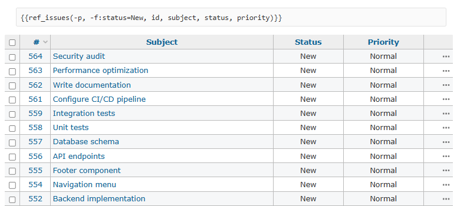

# redmine_wiki_lists

> **Tip**: With [redmine_studio_plugin](https://github.com/RedminePower/redmine_studio_plugin), you can manage this feature along with other useful features in one place.
> Also, combined with [Redmine Studio](https://www.redmine-power.com/), you can enjoy an even better Redmine experience.

## Overview

A plugin that provides macros to display lists of issues and wiki pages in wiki pages or issue descriptions.
Three macros are available: `wiki_list`, `issue_name_link`, and `ref_issues`.



For details, see [here](https://github.com/RedminePower/redmine_studio_plugin/blob/master/docs/wiki_lists-en.md).

## Supported Versions

- Redmine 5.x (tested with 5.1.11)
- Redmine 6.x (tested with 6.1.1)

## Installation

The Redmine installation path varies depending on your environment.
The following instructions use `/var/lib/redmine`.
Please adjust according to your environment.

| Environment | Redmine Path |
|-------------|--------------|
| apt (Debian/Ubuntu) | `/var/lib/redmine` |
| Docker (Official Image) | `/usr/src/redmine` |
| Bitnami | `/opt/bitnami/redmine` |

Run the following commands and restart Redmine.

```bash
cd /var/lib/redmine/plugins
git clone https://github.com/RedminePower/redmine_wiki_lists.git
```

## Uninstallation

Remove the plugin folder and restart Redmine.

```bash
cd /var/lib/redmine/plugins
rm -rf redmine_wiki_lists
```
